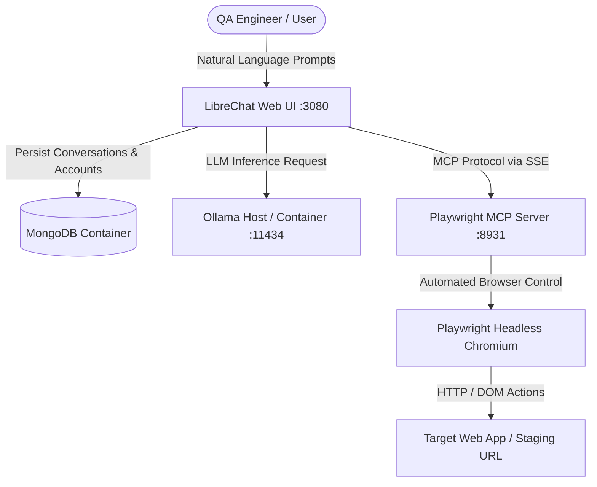

# 🤖 Local AI QA Engineer

> **Build Your Own Local AI QA Engineer with Docker, Ollama, LibreChat, and Playwright MCP**

An autonomous, 100% local, privacy-focused E2E web testing agent. Interact with an AI agent in natural language to run browser test cases, perform visual regression audits, verify forms, check DOM elements, capture screenshot evidence, and produce structured bug reports.

---

## 🏗️ Architecture Overview



- **LibreChat**: Advanced, feature-rich ChatGPT-like open-source web interface. Supports custom LLM endpoints, agents, presets, and MCP tools.
- **Ollama**: Local LLM engine. Recommended models: `qwen2.5-coder:7b`, `llama3.2:3b`, or `qwen3:8b`.
- **Playwright MCP Server**: Model Context Protocol server exposing browser manipulation capabilities (click, type, screenshot, evaluate JS, assert elements) to the LLM over SSE (`http://localhost:8931/sse`).
- **MongoDB**: Database backing LibreChat sessions and users.
- **Docker Compose**: Single command container orchestration.

---

## 📋 Prerequisites

1. **Docker Desktop** (with Docker Compose enabled)
2. **Ollama** installed on your host machine: [https://ollama.com](https://ollama.com)
3. Recommended hardware: 16 GB+ RAM, GPU optional (CPU inference supported).

---

## 🚀 Quickstart Guide

### Step 1: Install & Pull an Ollama Model
Start Ollama and pull a coding / agentic model:
```bash
# Start Ollama service (if not running)
ollama serve

# Pull recommended QA agent model
ollama pull qwen2.5-coder
```

### Step 2: Start the Local AI QA Engineer Stack

Run the PowerShell startup script (Windows):
```powershell
.\start.ps1
```
*Or using bash (Linux/macOS/Git Bash):*
```bash
chmod +x start.sh
./start.sh
```

Alternatively, use standard Docker Compose commands:
```bash
docker compose up -d --build
```

### Step 3: Access LibreChat UI
1. Open [http://localhost:3080](http://localhost:3080) in your web browser.
2. Create your local account (Registration is enabled by default).
3. Select **Ollama** as your endpoint and pick `qwen2.5-coder` or `llama3.2`.
4. Ensure MCP tools are enabled in the conversation header.

---

## 🧪 Prompting Your AI QA Engineer

Refer to [`prompts/qa_prompt_guide.md`](file:///c:/Users/LENOVO/Desktop/qa%20agent/prompts/qa_prompt_guide.md) for full system prompts and test scenarios.

### Sample Test Request
> *"Navigate to https://example.com. Verify the H1 header text. Click the 'More information' link. Confirm the new page loads successfully without console errors, and attach a screenshot."*

---

## 🛠️ Configuration Details

- `librechat.yaml`: Configures the Ollama API endpoint (`http://host.docker.internal:11434/v1`) and Playwright MCP integration (`http://playwright-mcp:8931/sse`).
- `docker-compose.yml`: Services networking and persistent volume mounts.
- `.env`: Environment settings and secrets.

---

## ❓ Troubleshooting

- **Ollama connection error inside container**: Ensure Ollama is running on your host machine. Docker accesses the host via `http://host.docker.internal:11434`.
- **Playwright MCP server unreachable**: Verify `docker compose ps` shows `qa-agent-playwright-mcp` as healthy and listening on port `8931`.
- **Reset Database**: Run `docker compose down -v` to reset MongoDB state.
